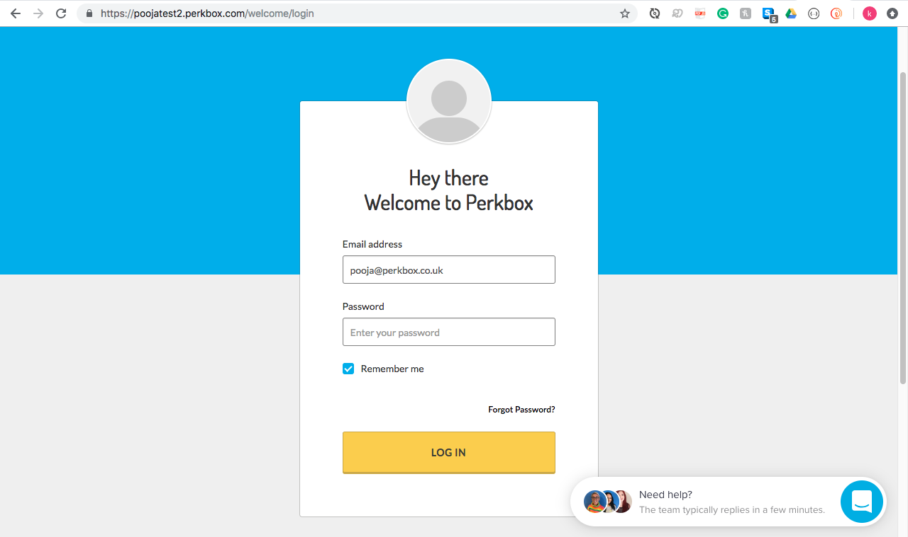

# QA Engineer Test

<br/>

[User Story ](#user-story) |
[Task ](#task) |
[Test Scenarios ](#test-scenarios) |
[Manual Testing ](#manual-testing) |
[Automated Testing ](#automated-testing) |
[Comments ](#comments)

<br/>

## User Story
**Feature**: As a user, I want the ability to select an account to login to.

* User enters their email address & clicks the continue button to see a list of accounts available to them.
* On selecting an account, they are taken to the account’s login page.
* On the login page, the email field should be pre-populated.  

<br/>

## Task  

1. &nbsp; List all possible **test scenarios** for this feature.
2. &nbsp; Choose two of the scenarios and carry out **manual testing** on these. Write up a **test report** for the results of this manual &nbsp; &nbsp; &nbsp; testing.
3. &nbsp; Again, choose two of the scenarios and write **automated tests** for these in the language of your choice.

<br/>

## Test-Scenarios

| Scenario ID  | Scenario Description  | Test Cases |
|:----:|---|---|
| 1  | Successfully visiting login page.  |- Verify whether user is on correct webpage. <br/> - Verify that there is a form containing an email input field and a &nbsp; &nbsp; &nbsp; &nbsp; &nbsp; &nbsp; &nbsp; continue button. |
| 2  | Successfully logging in with a valid email address. |- Verify that user cannot login without entering an email. <br/> - Verify that user cannot login with an invalid email. <br/> - Verify that user cannot login with an incorrect email. <br/> - Verify that on entering a valid email and clicking continue, the &nbsp; &nbsp; &nbsp; &nbsp; &nbsp; &nbsp; &nbsp; page will show a list of available accounts. |
| 3  | Select an account and successfully taken to account’s login page.  |- Verify that user can select an account and click confirm. <br/> - Verify whether url contains selected account’s name. |
| 4  | On account login page, the email field is pre-populated.  | - Verify that there is a form containing an email input field. <br/> - Verify whether email input is pre-populated with the correct email &nbsp; &nbsp; &nbsp; address. |

<br/>

## Manual-Testing

Manual Test Report:

<br/>

Below are screenshots of the manual testing process:

1. Login Homepage

<br/>

2. Login Without Email

<br/>

3. Login With Invalid Email

<br/>

4. Login With Incorrect Email

<br/>

5. Login With Correct Email

<br/>

6. See List of Available Accounts

<br/>

7. Select Account poojatest2

<br/>

8. Account login page is pre-populated with pooja@perkbox.co.uk


<br/>

According to the manual test, the feature seems to be working as intended:

<br/>  

&nbsp; &nbsp; &nbsp; &nbsp; &nbsp; &nbsp; &nbsp; &nbsp; &nbsp; &nbsp; &nbsp; &nbsp; &nbsp; &nbsp; &nbsp; &nbsp; &nbsp; &nbsp; &nbsp; &nbsp; &nbsp; &nbsp; &nbsp; &nbsp; &nbsp; &nbsp; &nbsp; &nbsp; &nbsp; &nbsp; &nbsp; &nbsp; &nbsp; &nbsp; &nbsp; &nbsp; &nbsp; &nbsp; &nbsp; &nbsp; &nbsp; &nbsp; &nbsp; 

<br/>

## Automated-Testing

Node Package Manager must be installed on your computer.  
In the terminal, paste these commands individually:

  ```
    git clone https://github.com/kirtimansingh93/testing-practice.git
    npm install
    ./node_modules/.bin/cypress open
  ```

1.  The cypress suite will open automatically.
2.  Open the directory in an editor of your choice.
3.  Navigate to the integration folder within the cypress folder.
4.  Delete the example folder which is within the integration folder.
5.  Now there should only be four numbered tests in the integration folder.
6.  Navigate to the cypress suite opens, either click run all tests or individually select the test you would like to run.  

Alternatively, if you want to run the tests in your terminal and create a recording of the tests (which are saved as mp4 files in the cypress folder under videos), paste this command in your terminal:

```
./node_modules/.bin/cypress run
```
<br/>

Tests:


<br/>
